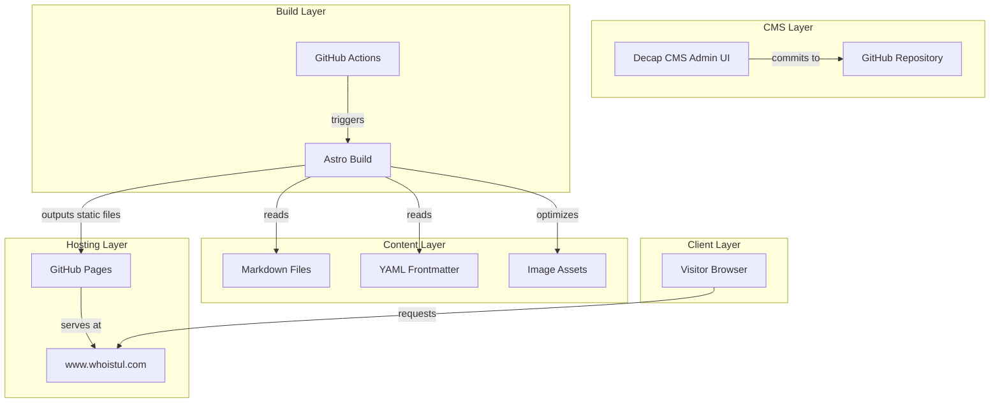
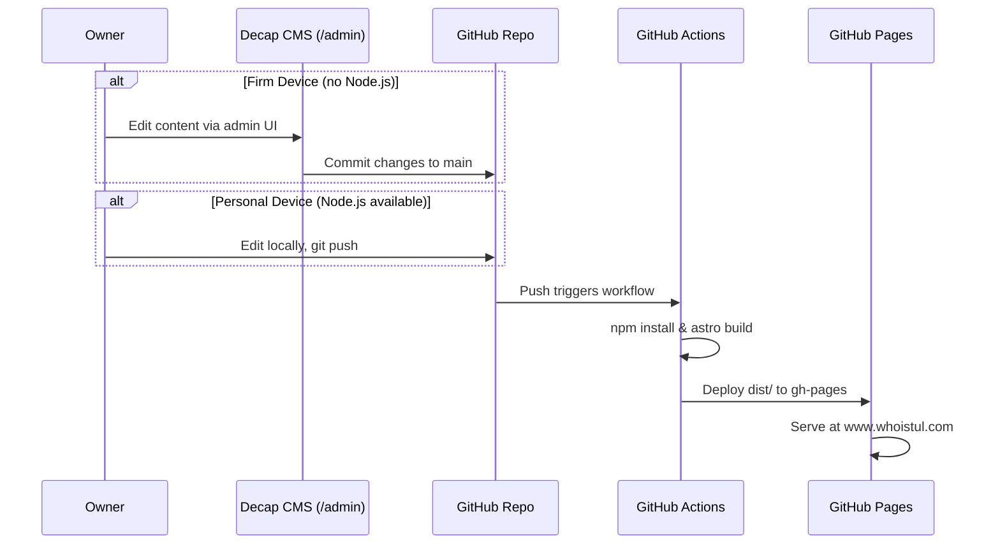

# Design Document: whoistul-website

## Overview

A personal brand website for Tul — a Data Analyst at Monix — built with the Astro framework and deployed to GitHub Pages at www.whoistul.com. The site follows a visual-first, minimal, cool-toned aesthetic inspired by meetjom.com (intellectual tone), northborders.co (minimal creator brand), and chester.how/hobbies (topic-based section breakdown).

The architecture is a static site with content collections managed through Decap CMS (git-based), enabling the owner to update content from any device — including a firm-issued laptop with no Node.js — by committing through the CMS admin UI or plain git, with GitHub Actions handling all builds.

### Design Decisions

| Decision | Choice | Rationale |
|---|---|---|
| Framework | Astro | Static-first, content-focused, ships zero JS by default, built-in image optimization |
| CMS | Decap CMS (formerly Netlify CMS) | Git-based, no backend server, works with GitHub Pages, provides admin UI at `/admin` |
| Hosting | GitHub Pages | Free, integrates with GitHub Actions, supports custom domains |
| Styling | Tailwind CSS | Utility-first, enforces design system consistency, small bundle with purging |
| Content format | Markdown + YAML frontmatter | Native Astro content collections, CMS-compatible, version-controlled |
| Image optimization | Astro `<Image>` component | Built-in WebP/AVIF generation, lazy loading, responsive srcsets |
| CI/CD | GitHub Actions | Enables deployment from devices without Node.js |

## Architecture

### High-Level Architecture



### Deployment Flow



## Components and Interfaces

### Astro Component Tree

```mermaid
graph TD
    BASE[BaseLayout.astro] --> NAV[Navbar.astro]
    BASE --> SLOT[Page Content - slot]
    BASE --> FOOTER[Footer.astro]
    BASE --> SEO[SEOHead.astro]

    HOME[index.astro] --> HERO[HeroSection.astro]
    HOME --> INTRO[IntroSection.astro]
    HOME --> FEATURED[FeaturedCards.astro]
    HOME --> NOW[NowSection.astro]
    HOME --> CTA[CTASection.astro]

    JOURNEY[journey.astro] --> TIMELINE[Timeline.astro]
    TIMELINE --> TMITEM[TimelineItem.astro]

    BLOG_LIST[blog/index.astro] --> BLOGCARD[BlogCard.astro]
    BLOG_POST[blog/...slug.astro] --> PROSE[Prose content]

    HOBBIES[hobbies.astro] --> HOBNAV[HobbyNav.astro]
    HOBBIES --> PHOTOSEC[PhotographySection.astro]
    HOBBIES --> TRAVELSEC[TravelSection.astro]
    HOBBIES --> SPORTSEC[SportsSection.astro]
    HOBBIES --> MOTORSEC[MotorsportSection.astro]

    CONTACT[contact.astro] --> CONTACTCARD[ContactCard.astro]

    SHARED[Shared Components]
    SHARED --> IMGOPT[OptimizedImage.astro]
    SHARED --> CARD[ContentCard.astro]
    SHARED --> SECTIONWRAP[Section.astro]
```



### Component Interfaces

#### BaseLayout.astro
```typescript
interface Props {
  title: string;
  description: string;
  ogImage?: string;
  currentPage?: string; // for active nav highlighting
}
```

#### SEOHead.astro
```typescript
interface Props {
  title: string;
  description: string;
  ogImage?: string;
  canonicalUrl?: string;
}
```

#### Navbar.astro
```typescript
interface Props {
  currentPage?: string; // "home" | "journey" | "blog" | "hobbies" | "contact" | "now"
}
```

#### HeroSection.astro
```typescript
interface Props {
  headline: string;
  subheadline: string;
  image: ImageMetadata;
  imageAlt: string;
}
```

#### NowSection.astro
```typescript
interface Props {
  content: string;       // markdown content
  lastUpdated: Date;
}
```

#### Timeline.astro
```typescript
interface Props {
  milestones: TimelineMilestone[];
}
```

#### TimelineItem.astro
```typescript
interface Props {
  title: string;
  date: string;
  description: string;
  image?: ImageMetadata;
  imageAlt?: string;
}
```

#### BlogCard.astro
```typescript
interface Props {
  title: string;
  date: Date;
  slug: string;
  excerpt?: string;
  coverImage?: ImageMetadata;
}
```

#### ContentCard.astro
```typescript
interface Props {
  title: string;
  description?: string;
  image?: ImageMetadata;
  imageAlt?: string;
  href?: string;
}
```

#### OptimizedImage.astro
```typescript
interface Props {
  src: ImageMetadata;
  alt: string;
  width?: number;
  height?: number;
  class?: string;
  loading?: "lazy" | "eager";
}
```

#### Section.astro
```typescript
interface Props {
  id?: string;
  class?: string;
  fullWidth?: boolean;
}
// Wraps content in consistent spacing (py-16 / 64px gap) and max-width container
```

### Page Layouts

#### Homepage (index.astro)
1. **Hero Section** — Full-width, headline left + portrait image right (stacks on mobile). Headline: display font, 48px desktop / 32px mobile. Subheadline: body font, muted color.
2. **Brief Introduction** — 2-3 sentences about Tul. Clean, centered text block.
3. **Now Section** — Card showing current focus areas with last-updated date. Pulled from `now` content collection.
4. **Featured Content** — 3 cards max: latest blog posts or curated hobby highlights. Uses `ContentCard` component.
5. **CTA** — Subtle link to Journey page. "See where I've been →" style.

#### Journey Page (journey.astro)
- Vertical timeline, alternating left/right on desktop, single-column on mobile.
- Each milestone: title, date, short description, optional image.
- Milestones sourced from `journey` content collection.

#### Blog Page (blog/index.astro + blog/[...slug].astro)
- Index: list of blog cards sorted newest-first. Each card shows title, date (DD MMM YYYY), excerpt.
- Post page: rendered Markdown with prose styling. Includes publication date, optional cover image.

#### Hobbies Page (hobbies.astro)
- In-page navigation (anchor links/tabs) for 4 sections: Photography, Travel, Sports, Motorsport.
- **Photography**: masonry grid gallery.
- **Travel**: content grid with location cards.
- **Sports**: text + image layout (badminton focus).
- **Motorsport**: text + image layout (F1 focus).

#### Contact Page (contact.astro)
- Minimal layout. Email link + social media links (open in new tab).
- Consistent with design system.

#### Now Page (now.astro) — optional standalone or homepage section
- What Tul is currently working on, reading, exploring.
- Last-updated date displayed.
- Editable via CMS.


## Data Models

### Content Collections (Astro)

Astro content collections define the schema for all Markdown/MDX content. Defined in `src/content/config.ts`.

```typescript
import { defineCollection, z } from 'astro:content';

const blog = defineCollection({
  type: 'content',
  schema: ({ image }) => z.object({
    title: z.string(),
    date: z.date(),
    excerpt: z.string().optional(),
    coverImage: image().optional(),
    coverImageAlt: z.string().optional(),
    tags: z.array(z.string()).optional(),
    draft: z.boolean().default(false),
  }),
});

const journey = defineCollection({
  type: 'content',
  schema: ({ image }) => z.object({
    title: z.string(),
    date: z.date(),
    description: z.string(),
    image: image().optional(),
    imageAlt: z.string().optional(),
    order: z.number().optional(), // for manual ordering if needed
  }),
});

const hobbies = defineCollection({
  type: 'content',
  schema: ({ image }) => z.object({
    title: z.string(),
    category: z.enum(['photography', 'travel', 'sports', 'motorsport']),
    description: z.string().optional(),
    image: image().optional(),
    imageAlt: z.string().optional(),
    order: z.number().optional(),
  }),
});

const now = defineCollection({
  type: 'content',
  schema: z.object({
    lastUpdated: z.date(),
  }),
});

const pages = defineCollection({
  type: 'content',
  schema: ({ image }) => z.object({
    title: z.string(),
    description: z.string().optional(),
    heroImage: image().optional(),
    heroImageAlt: z.string().optional(),
  }),
});

export const collections = { blog, journey, hobbies, now, pages };
```

### Frontmatter Examples

**Blog post** (`src/content/blog/my-first-post.md`):
```yaml
---
title: "Thinking in Systems"
date: 2025-06-15
excerpt: "How a consulting mindset shapes the way I see everyday problems."
coverImage: "./images/systems-thinking.jpg"
coverImageAlt: "Whiteboard with system diagrams"
tags: ["thinking", "consulting"]
draft: false
---
```

**Journey milestone** (`src/content/journey/pwc-analyst.md`):
```yaml
---
title: "Data Analyst at PwC Thailand"
date: 2024-01-15
description: "Joined PwC's consulting practice, working on data-driven projects."
image: "./images/pwc.jpg"
imageAlt: "PwC office"
---
```

**Now section** (`src/content/now/current.md`):
```yaml
---
lastUpdated: 2025-06-20
---
Currently exploring MBA programs and building this website.
Reading "Thinking, Fast and Slow" by Daniel Kahneman.
Shooting street photography on weekends.
```

### File/Folder Structure

```
whoistul-website/
├── .github/
│   └── workflows/
│       └── deploy.yml              # GitHub Actions build + deploy
├── public/
│   ├── admin/
│   │   ├── index.html              # Decap CMS admin page
│   │   └── config.yml              # Decap CMS configuration
│   ├── CNAME                       # Custom domain: www.whoistul.com
│   ├── favicon.svg
│   └── robots.txt
├── src/
│   ├── components/
│   │   ├── BaseLayout.astro
│   │   ├── SEOHead.astro
│   │   ├── Navbar.astro
│   │   ├── Footer.astro
│   │   ├── HeroSection.astro
│   │   ├── IntroSection.astro
│   │   ├── NowSection.astro
│   │   ├── FeaturedCards.astro
│   │   ├── CTASection.astro
│   │   ├── Timeline.astro
│   │   ├── TimelineItem.astro
│   │   ├── BlogCard.astro
│   │   ├── ContentCard.astro
│   │   ├── HobbyNav.astro
│   │   ├── PhotographySection.astro
│   │   ├── TravelSection.astro
│   │   ├── SportsSection.astro
│   │   ├── MotorsportSection.astro
│   │   ├── ContactCard.astro
│   │   ├── OptimizedImage.astro
│   │   └── Section.astro
│   ├── content/
│   │   ├── config.ts               # Content collection schemas
│   │   ├── blog/
│   │   │   └── my-first-post.md
│   │   ├── journey/
│   │   │   ├── chula-economics.md
│   │   │   └── pwc-analyst.md
│   │   ├── hobbies/
│   │   │   ├── photography.md
│   │   │   ├── travel.md
│   │   │   ├── sports.md
│   │   │   └── motorsport.md
│   │   ├── now/
│   │   │   └── current.md
│   │   └── pages/
│   │       ├── home.md
│   │       ├── contact.md
│   │       └── hobbies.md
│   ├── pages/
│   │   ├── index.astro              # Homepage
│   │   ├── journey.astro
│   │   ├── hobbies.astro
│   │   ├── contact.astro
│   │   ├── now.astro
│   │   └── blog/
│   │       ├── index.astro          # Blog listing
│   │       └── [...slug].astro      # Blog post pages
│   ├── styles/
│   │   └── global.css               # Tailwind directives + custom styles
│   └── lib/
│       └── utils.ts                 # Date formatting, helpers
├── astro.config.mjs
├── tailwind.config.mjs
├── tsconfig.json
├── package.json
└── README.md
```

### Decap CMS Configuration (`public/admin/config.yml`)

```yaml
backend:
  name: github
  repo: <owner>/<repo>
  branch: main

media_folder: "src/content/blog/images"
public_folder: "./images"

collections:
  - name: "blog"
    label: "Blog Posts"
    folder: "src/content/blog"
    create: true
    slug: "{{slug}}"
    fields:
      - { label: "Title", name: "title", widget: "string" }
      - { label: "Date", name: "date", widget: "datetime" }
      - { label: "Excerpt", name: "excerpt", widget: "string", required: false }
      - { label: "Cover Image", name: "coverImage", widget: "image", required: false }
      - { label: "Cover Image Alt", name: "coverImageAlt", widget: "string", required: false }
      - { label: "Tags", name: "tags", widget: "list", required: false }
      - { label: "Draft", name: "draft", widget: "boolean", default: false }
      - { label: "Body", name: "body", widget: "markdown" }

  - name: "journey"
    label: "Journey Milestones"
    folder: "src/content/journey"
    create: true
    slug: "{{slug}}"
    fields:
      - { label: "Title", name: "title", widget: "string" }
      - { label: "Date", name: "date", widget: "datetime" }
      - { label: "Description", name: "description", widget: "string" }
      - { label: "Image", name: "image", widget: "image", required: false }
      - { label: "Image Alt", name: "imageAlt", widget: "string", required: false }
      - { label: "Order", name: "order", widget: "number", required: false }
      - { label: "Body", name: "body", widget: "markdown" }

  - name: "now"
    label: "Now"
    files:
      - label: "Current"
        name: "current"
        file: "src/content/now/current.md"
        fields:
          - { label: "Last Updated", name: "lastUpdated", widget: "datetime" }
          - { label: "Body", name: "body", widget: "markdown" }

  - name: "hobbies"
    label: "Hobbies"
    folder: "src/content/hobbies"
    create: true
    slug: "{{slug}}"
    fields:
      - { label: "Title", name: "title", widget: "string" }
      - { label: "Category", name: "category", widget: "select", options: ["photography", "travel", "sports", "motorsport"] }
      - { label: "Description", name: "description", widget: "string", required: false }
      - { label: "Image", name: "image", widget: "image", required: false }
      - { label: "Image Alt", name: "imageAlt", widget: "string", required: false }
      - { label: "Order", name: "order", widget: "number", required: false }
      - { label: "Body", name: "body", widget: "markdown" }
```

### GitHub Actions Workflow (`.github/workflows/deploy.yml`)

```yaml
name: Deploy to GitHub Pages

on:
  push:
    branches: [main]
  workflow_dispatch:

permissions:
  contents: read
  pages: write
  id-token: write

concurrency:
  group: "pages"
  cancel-in-progress: false

jobs:
  build:
    runs-on: ubuntu-latest
    steps:
      - name: Checkout
        uses: actions/checkout@v4

      - name: Setup Node
        uses: actions/setup-node@v4
        with:
          node-version: 20
          cache: npm

      - name: Install dependencies
        run: npm ci

      - name: Build Astro site
        run: npm run build

      - name: Upload artifact
        uses: actions/upload-pages-artifact@v3
        with:
          path: dist

  deploy:
    needs: build
    runs-on: ubuntu-latest
    environment:
      name: github-pages
      url: ${{ steps.deployment.outputs.page_url }}
    steps:
      - name: Deploy to GitHub Pages
        id: deployment
        uses: actions/deploy-pages@v4
```

### Design System Tokens

```css
/* Color Palette — Cool-tone minimal */
:root {
  --color-bg:        #FAFAFA;   /* near-white background */
  --color-bg-alt:    #F0F0F2;   /* subtle section backgrounds */
  --color-text:      #1A1A1A;   /* primary text */
  --color-text-muted: #6B7280;  /* secondary/muted text */
  --color-accent:    #3B5998;   /* cool blue accent */
  --color-accent-hover: #2D4373;
  --color-border:    #E5E7EB;   /* subtle borders */
  --color-card-bg:   #FFFFFF;   /* card backgrounds */

  /* Typography */
  --font-display: 'Inter', system-ui, sans-serif;
  --font-body: 'Inter', system-ui, sans-serif;
  --font-size-xs:   0.75rem;    /* 12px */
  --font-size-sm:   0.875rem;   /* 14px */
  --font-size-base: 1rem;       /* 16px */
  --font-size-lg:   1.125rem;   /* 18px */
  --font-size-xl:   1.25rem;    /* 20px */
  --font-size-2xl:  1.5rem;     /* 24px */
  --font-size-3xl:  1.875rem;   /* 30px */
  --font-size-4xl:  2.25rem;    /* 36px */
  --font-size-hero: 3rem;       /* 48px */

  /* Spacing — 8px grid */
  --space-1:  0.25rem;   /* 4px */
  --space-2:  0.5rem;    /* 8px */
  --space-3:  0.75rem;   /* 12px */
  --space-4:  1rem;      /* 16px */
  --space-6:  1.5rem;    /* 24px */
  --space-8:  2rem;      /* 32px */
  --space-12: 3rem;      /* 48px */
  --space-16: 4rem;      /* 64px */
  --space-20: 5rem;      /* 80px */
  --space-24: 6rem;      /* 96px */

  /* Layout */
  --max-width: 1200px;

  /* Transitions */
  --transition-fast: 200ms ease;
  --transition-base: 300ms ease;
}
```

### Tailwind Configuration Highlights

```javascript
// tailwind.config.mjs
export default {
  content: ['./src/**/*.{astro,html,js,jsx,md,mdx,svelte,ts,tsx,vue}'],
  theme: {
    extend: {
      fontFamily: {
        display: ['Inter', 'system-ui', 'sans-serif'],
        body: ['Inter', 'system-ui', 'sans-serif'],
      },
      colors: {
        bg: { DEFAULT: '#FAFAFA', alt: '#F0F0F2' },
        text: { DEFAULT: '#1A1A1A', muted: '#6B7280' },
        accent: { DEFAULT: '#3B5998', hover: '#2D4373' },
        border: '#E5E7EB',
        card: '#FFFFFF',
      },
      maxWidth: {
        content: '1200px',
      },
      spacing: {
        // 8px grid already default in Tailwind
      },
    },
  },
};
```

### Astro Configuration

```javascript
// astro.config.mjs
import { defineConfig } from 'astro/config';
import tailwind from '@astrojs/tailwind';
import sitemap from '@astrojs/sitemap';

export default defineConfig({
  site: 'https://www.whoistul.com',
  integrations: [tailwind(), sitemap()],
  output: 'static',
  build: {
    assets: '_assets',
  },
  image: {
    service: {
      entrypoint: 'astro/assets/services/sharp',
    },
  },
});
```

### Utility Functions (`src/lib/utils.ts`)

```typescript
/**
 * Format a Date to "DD MMM YYYY" (e.g., "15 Jun 2025")
 */
export function formatDate(date: Date): string {
  return date.toLocaleDateString('en-GB', {
    day: '2-digit',
    month: 'short',
    year: 'numeric',
  });
}

/**
 * Sort items by date descending (newest first)
 */
export function sortByDateDesc<T extends { data: { date: Date } }>(items: T[]): T[] {
  return [...items].sort((a, b) => b.data.date.getTime() - a.data.date.getTime());
}
```

## Correctness Properties

*A property is a characteristic or behavior that should hold true across all valid executions of a system — essentially, a formal statement about what the system should do. Properties serve as the bridge between human-readable specifications and machine-verifiable correctness guarantees.*

### Property 1: Active navigation link matches current page

*For any* valid page identifier passed as `currentPage` to the Navbar component, exactly one navigation link should have the active visual indicator, and it should correspond to the page identifier provided.

**Validates: Requirements 1.3**

### Property 2: Featured content card count is capped at 3

*For any* content collection of size N (where N ≥ 0), the number of featured content cards rendered on the Homepage should equal min(N, 3).

**Validates: Requirements 3.3**

### Property 3: Date-based sorting produces correct order

*For any* array of items with date fields, applying `sortByDateDesc` should produce an array where each item's date is greater than or equal to the next item's date (descending order).

**Validates: Requirements 4.1, 5.1**

### Property 4: Journey milestone rendering includes required fields

*For any* journey milestone with a title, date, and description, the rendered TimelineItem output should contain the title text, the formatted date, and the description text.

**Validates: Requirements 4.2**

### Property 5: Date formatting produces "DD MMM YYYY" pattern

*For any* valid JavaScript Date object, the `formatDate` function should return a string matching the pattern of a 2-digit day, a 3-letter month abbreviation, and a 4-digit year (e.g., "15 Jun 2025").

**Validates: Requirements 5.2**

### Property 6: Blog card links to correct post URL

*For any* blog post with a slug, the rendered BlogCard component should produce an anchor element whose href equals `/blog/{slug}`.

**Validates: Requirements 5.3**

### Property 7: Hobby section rendering includes title and introductory text

*For any* hobby content entry with a title and description, the rendered hobby section should contain both the title and the description/introductory text.

**Validates: Requirements 6.2**

### Property 8: External links open in new tab with security attributes

*For any* external link rendered on the Contact page (or any page), the anchor element should have `target="_blank"` and `rel` containing `noopener`.

**Validates: Requirements 7.2**

### Property 9: OptimizedImage outputs correct HTML attributes

*For any* image rendered via the OptimizedImage component with a given `alt` text and `loading` value, the output HTML should include the `alt` attribute matching the provided text, and when `loading` is set to `"lazy"`, the `loading="lazy"` attribute should be present.

**Validates: Requirements 13.3, 13.4**

### Property 10: Now section displays last-updated date

*For any* Now section content with a `lastUpdated` date, the rendered NowSection component should display the formatted date string in the output.

**Validates: Requirements 14.3**

### Property 11: SEO meta tags are present for all pages

*For any* page rendered with a `title` and `description`, the SEOHead component output should contain a `<title>` element with the title text, a `<meta name="description">` with the description, and Open Graph `<meta property="og:title">` and `<meta property="og:description">` tags.

**Validates: Requirements 16.1**

### Property 12: Pages use semantic HTML structure

*For any* page rendered through BaseLayout, the output HTML should contain `<header>`, `<nav>`, `<main>`, and `<footer>` semantic elements.

**Validates: Requirements 16.4**

## Error Handling

### Image Loading Failures
- The `OptimizedImage` component renders with a descriptive `alt` attribute on every `` tag. When an image fails to load, the browser displays the alt text natively.
- A CSS fallback applies a neutral background color (`var(--color-bg-alt)`) to image containers so broken images don't leave blank holes.

### Content Collection Errors
- Astro's content collection schemas (Zod) validate frontmatter at build time. Invalid frontmatter (missing required fields, wrong types) causes a build error with a clear message, preventing broken content from reaching production.
- Optional fields (`excerpt`, `coverImage`, `tags`, `image`) default gracefully — components conditionally render these only when present.

### Empty Content States
- Blog listing: if no blog posts exist, display a message like "No posts yet. Check back soon."
- Journey timeline: if no milestones exist, display a placeholder message.
- Featured cards on homepage: if fewer than 3 items exist, render only what's available (Property 2 handles this).
- Now section: if no `current.md` exists, hide the Now section from the homepage.

### CMS Errors
- Decap CMS handles its own authentication errors (GitHub OAuth). If auth fails, the CMS shows its built-in error screen.
- If the CMS commits invalid frontmatter, the GitHub Actions build will fail, preventing deployment of broken content. The owner can fix via the CMS or by reverting the commit.

### Build and Deployment Errors
- GitHub Actions workflow fails fast on any step failure (checkout, install, build, deploy).
- Build errors from Astro (invalid content, missing imports) are surfaced in the Actions log.
- The `concurrency` setting in the workflow prevents overlapping deployments.

### 404 / Missing Pages
- Astro generates a `404.astro` page that matches the site's design system, providing navigation back to the homepage.

## Testing Strategy

### Dual Testing Approach

This project uses both unit tests and property-based tests for comprehensive coverage.

- **Unit tests**: Verify specific examples, edge cases, integration points, and configuration correctness.
- **Property-based tests**: Verify universal properties across randomly generated inputs using a PBT library.

### Testing Framework

- **Test runner**: Vitest (native Astro/Vite integration)
- **Property-based testing library**: fast-check (JavaScript/TypeScript PBT library)
- **Configuration**: Each property test runs a minimum of 100 iterations

### Property-Based Tests

Each property test references its design document property with a tag comment.

| Property | Test Description | Tag |
|---|---|---|
| Property 1 | Generate random page identifiers, render Navbar, assert exactly one active link matches | `Feature: whoistul-website, Property 1: Active navigation link matches current page` |
| Property 2 | Generate arrays of 0–20 content items, assert rendered card count = min(N, 3) | `Feature: whoistul-website, Property 2: Featured content card count is capped at 3` |
| Property 3 | Generate arrays of random dates, apply sortByDateDesc, assert descending order | `Feature: whoistul-website, Property 3: Date-based sorting produces correct order` |
| Property 4 | Generate random milestone data (title, date, description), render TimelineItem, assert all fields present in output | `Feature: whoistul-website, Property 4: Journey milestone rendering includes required fields` |
| Property 5 | Generate random valid Dates, apply formatDate, assert output matches /^\d{2} [A-Z][a-z]{2} \d{4}$/ | `Feature: whoistul-website, Property 5: Date formatting produces "DD MMM YYYY" pattern` |
| Property 6 | Generate random slugs, render BlogCard, assert href = /blog/{slug} | `Feature: whoistul-website, Property 6: Blog card links to correct post URL` |
| Property 7 | Generate random hobby entries with title and description, render section, assert both present | `Feature: whoistul-website, Property 7: Hobby section rendering includes title and introductory text` |
| Property 8 | Generate random external URLs, render contact links, assert target="_blank" and rel contains "noopener" | `Feature: whoistul-website, Property 8: External links open in new tab with security attributes` |
| Property 9 | Generate random alt text and loading values, render OptimizedImage, assert alt and loading attributes correct | `Feature: whoistul-website, Property 9: OptimizedImage outputs correct HTML attributes` |
| Property 10 | Generate random dates, render NowSection, assert formatted date appears in output | `Feature: whoistul-website, Property 10: Now section displays last-updated date` |
| Property 11 | Generate random title/description pairs, render SEOHead, assert title, meta description, and OG tags present | `Feature: whoistul-website, Property 11: SEO meta tags are present for all pages` |
| Property 12 | Render pages through BaseLayout, assert presence of header, nav, main, footer semantic elements | `Feature: whoistul-website, Property 12: Pages use semantic HTML structure` |

### Unit Tests

Unit tests cover specific examples, edge cases, and configuration checks:

- **Navigation**: Navbar renders all 5 links (Req 1.1), links have correct hrefs (Req 1.2)
- **Homepage**: Hero section renders headline, subheadline, image (Req 2.1); sections appear in correct order (Req 3.1)
- **Blog**: Schema accepts custom publication date (Req 5.5); Markdown rendering works for supported elements (Req 5.4)
- **Hobbies**: Page has 4 topic sections (Req 6.1); anchor links exist for each section (Req 6.3)
- **Contact**: At least 2 contact methods displayed (Req 7.1)
- **CMS**: Admin page exists at /admin (Req 10.1); CMS config includes date field for blog (Req 10.3); CMS config covers all content collections (Req 10.4)
- **Deployment**: CNAME file contains www.whoistul.com (Req 11.4); GitHub Actions workflow triggers on push to main (Req 11.3); Astro site config has correct domain (Req 11.2)
- **Images**: Astro config uses image optimization service (Req 13.2)
- **Now section**: Now section is linked from homepage or nav (Req 14.1); CMS config includes now collection (Req 14.2)
- **SEO**: Sitemap integration is configured (Req 16.2)
- **404**: Custom 404 page exists and renders with site layout
